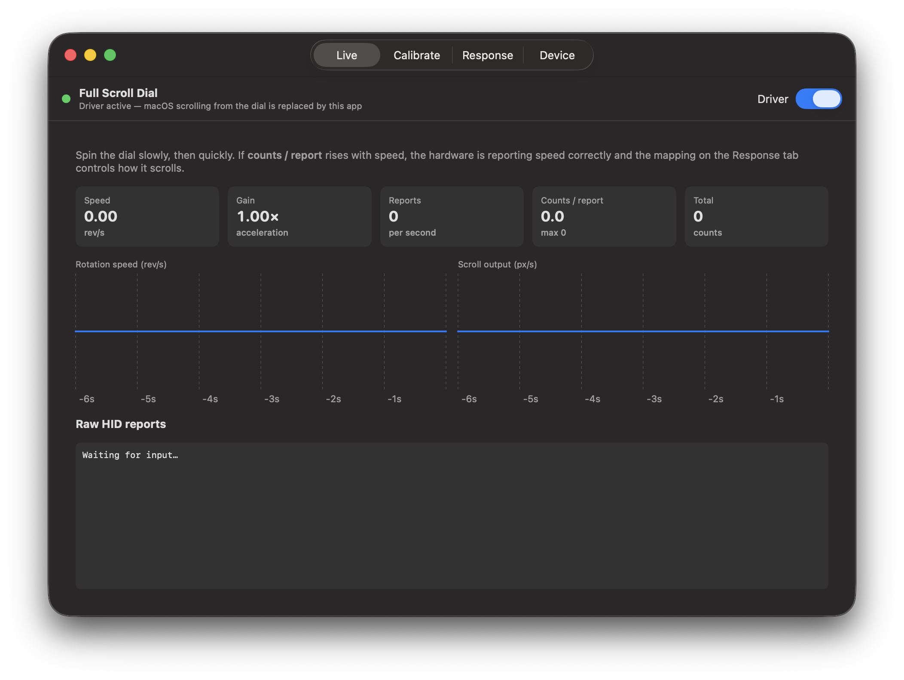
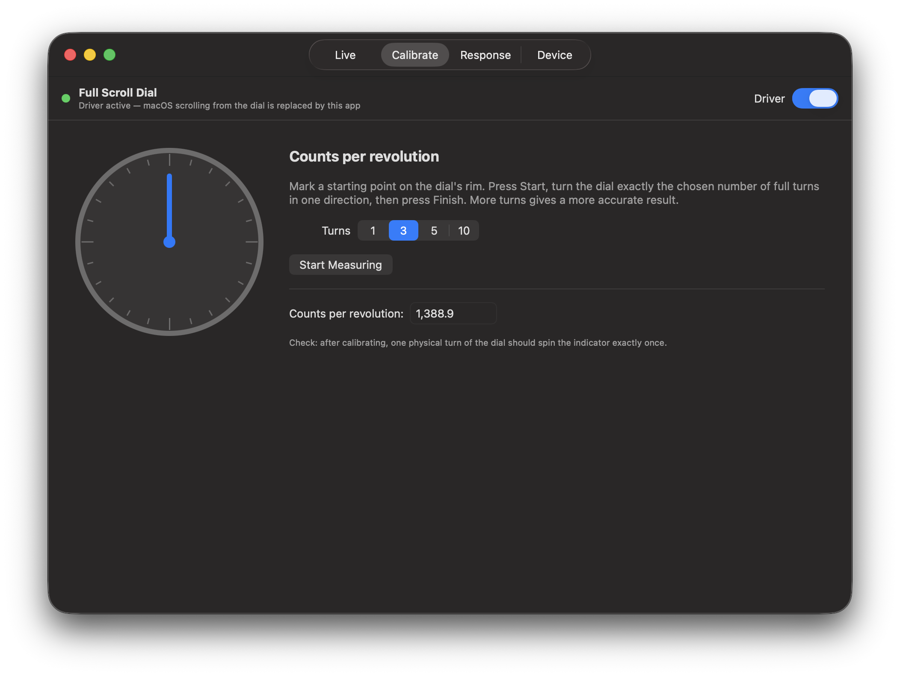
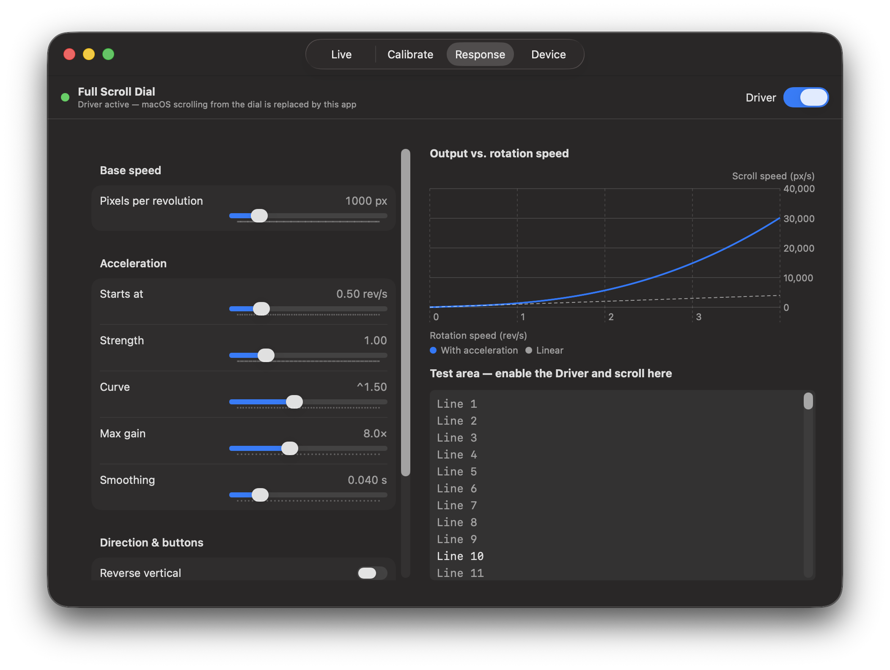
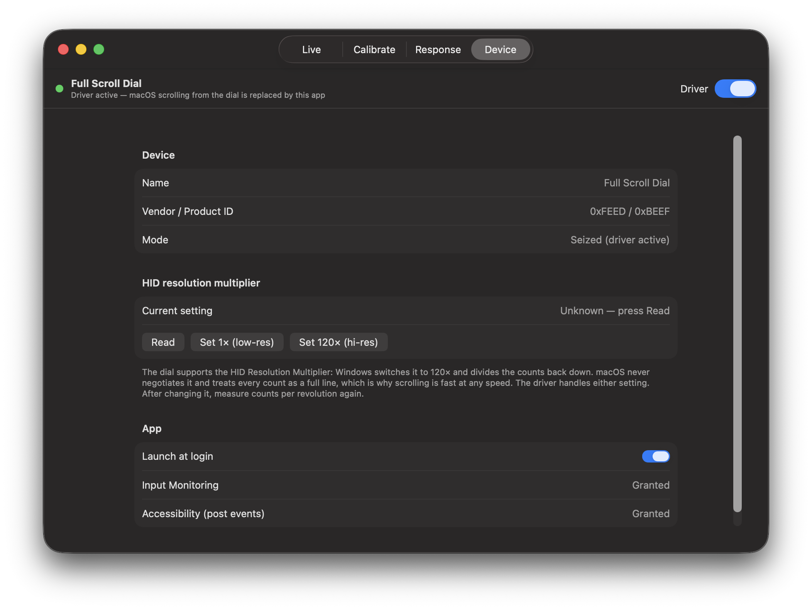

# Full Scroll Dial — macOS driver & calibrator

## Why it scrolls fast on macOS
The dial reports a 16-bit high-resolution wheel (HID reports 3/5) together with a
HID Resolution Multiplier (feature report 2, 1×/120×). Windows negotiates the
multiplier and divides the counts back down. macOS ignores it and treats each
count as a whole line, then adds its own acceleration, so even slow turns scroll fast.

## What this app does
With **Driver** on, the app takes exclusive control of the dial (VID 0xFEED / PID 0xBEEF)
through IOHIDManager, so macOS stops interpreting it. It then reads the raw counts and posts
smooth pixel scroll events:

    pixels = revolutions × pixelsPerRevolution × gain(rev/s)

Button and pointer reports are forwarded too.

## Build
    xcodegen generate        # project.yml is the source of truth
    open FSDDriver.xcodeproj

## First run
1. Grant **Input Monitoring** (to read the dial) and **Accessibility** (to post scroll events).
   Builds are ad-hoc signed, so macOS may ask again after a rebuild.
2. **Live** tab: spin slowly, then quickly, and watch counts/report and speed.
3. **Calibrate** tab: measure counts per revolution (several turns gives a better result).
4. **Response** tab: set the base speed and acceleration curve, then try the test area.
5. Turn on **Driver**. The app keeps running from the menu bar after you close the window.

## Screenshots

### Live
Real-time speed, gain, report rate, counts per report, and the raw HID report log.

### Calibrate
Measure counts per revolution by turning the dial a known number of full turns.

### Response
Tune base speed and the acceleration curve, then try it in the test area.

### Device
Device info, HID resolution multiplier controls, launch at login, and permission status.

